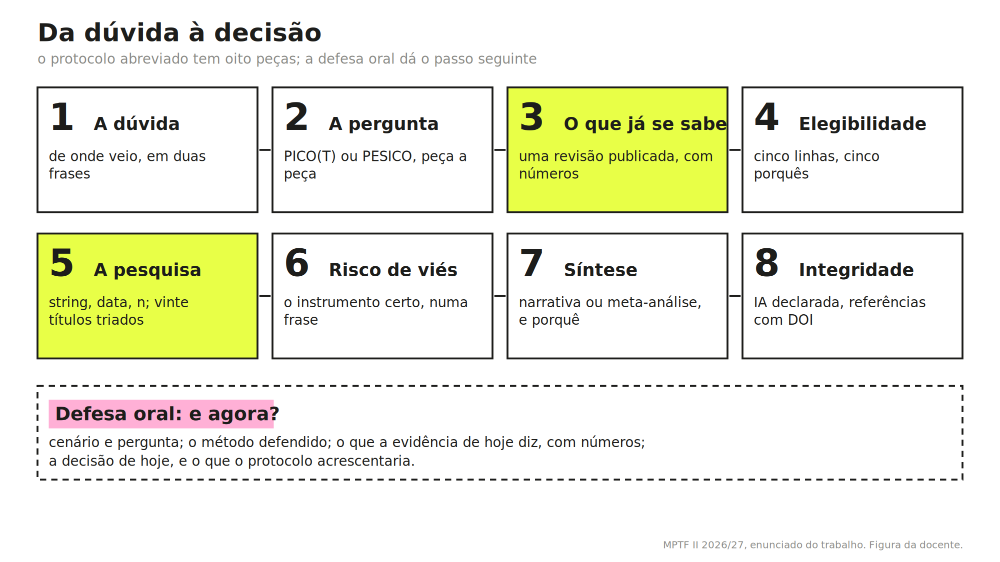

# MPTF II, ESSAlcoitão, 2026/27 {.unnumbered}

Este é o percurso da unidade curricular Métodos de Pesquisa em Terapia da Fala II (2.º ano da Licenciatura em Terapia da Fala, ESSAlcoitão), no ano letivo de 2026/27. As aulas são às terças-feiras, das 14 às 18 horas, de 22 de setembro a 10 de novembro. A primeira sessão foi dada pela regente, Margarida Ramalho (apresentação da unidade curricular e do trabalho); as sete seguintes são dadas por Joana Miguel. Cada capítulo do livro fica visível depois da aula a que corresponde; a tabela diz qual, quando, e o que ler antes.

| Data | Sessão | Capítulos que ficam visíveis depois | Ler antes |
|---|---|---|---|
| 22 set | Apresentação da unidade curricular e do trabalho (regente) | — | — |
| 29 set | Ler um resultado; descrever e desconfiar | 01 e 02 | Altman e Bland (1995); Patino e Ferreira (2015) |
| 6 out | O valor p; testes no Jamovi; quantas pessoas tratar para uma melhorar | 03 | Ferreira e Patino (2015), "What does the p value really mean?" |
| 13 out | Da dúvida à pergunta; bases de dados e gestores de referências | 04 | Richardson et al. (1995) |
| 20 out | Ética e tipos de estudo | 05 | Declaração de Helsínquia, versão de 2024; Munn et al. (2018) |
| 27 out | Prática baseada na evidência e análise crítica; risco de viés | 06 | Ebbels et al. (2019) |
| 3 nov | Revisão sistemática; escrita científica | 07 | Donato e Donato (2019); PRISMA 2020 |
| 10 nov | Defesa oral | — | — |
| 17 nov, 23:59 | Entrega do protocolo escrito | — | — |

As leituras estão em "Para ler", com o DOI de cada uma; todas são de acesso livre. Para a sessão de 6 de outubro é preciso ter o Jamovi instalado (gratuito, [jamovi.org](https://www.jamovi.org)) e trazer o computador.

## O trabalho

O trabalho é individual e tem duas partes: um protocolo abreviado de revisão sistemática, escrito, sobre uma pergunta clínica em terapia da fala que nasce de uma dúvida do próprio estudante (60 % da classificação; entrega a 17 de novembro, até às 23:59), e a defesa oral desse protocolo, em aula, a 10 de novembro (40 %). O enunciado completo, com as oito secções do protocolo, as duas grelhas e as regras, está aqui: [enunciado do trabalho (docx)](enunciado-mptf-ii-2026.docx). A versão que conta é a que foi apresentada em aula a 22 de setembro.

{width=100%}

### Calendário do trabalho

| Data | Etapa |
|---|---|
| 6 out | Dúvida clínica, numa frase, entregue em aula |
| 13 out | Pergunta PICO(T) ou PESICO em rascunho, trabalhada em aula |
| até 20 out | Pedido de validação da pergunta, por email |
| até 24 out | Resposta da docente, por escrito |
| até 31 out | Validação de uma pergunta alternativa, se a primeira não tiver sido aceite |
| 27 out | Pesquisa executada e registada, em aula |
| 3 nov | Rascunho completo, para feedback em aula; sorteio da ordem das defesas |
| 10 nov | Defesa oral |
| 17 nov, 23:59 | Entrega do protocolo escrito |

Uma pergunta não validada até 24 de outubro não pode ser usada no trabalho. Os exemplos de perguntas mostrados nas aulas não podem ser usados como tema.

### Como se chega à nota

Protocolo escrito (cada critério de 0 a 20, ponderado): dúvida, pergunta e o que já se sabe, 30 (sem os números da revisão publicada, este critério não passa de 13); critérios de elegibilidade, 15; pesquisa e triagem, 30; risco de viés e síntese, 10; escrita, formato e integridade, 15. Defesa oral: cenário clínico e pergunta, 30; método defendido, 30; "e agora?", 25; tempo e perguntas, 15. A aprovação exige classificação final igual ou superior a 10 valores. Os descritores completos de cada critério estão no enunciado.

## Contacto

joana.miguel@scml.pt; terças, antes ou depois da aula.
